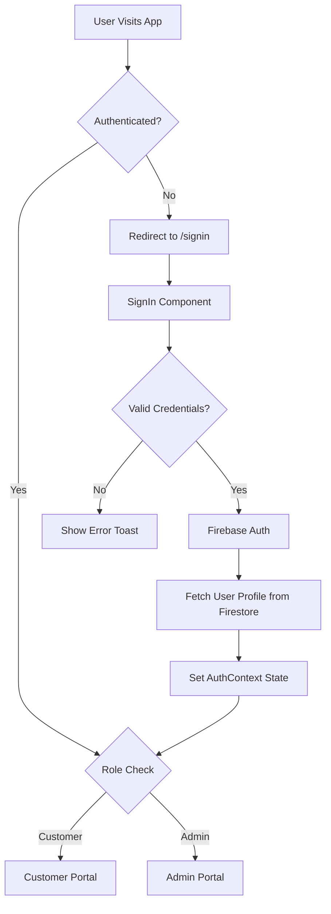

# JustFence - Fencing Business Management Application

A production-ready React + Firebase application for managing a fencing business with separate portals for customers and administrators.

## 📋 Table of Contents

- [Features](#features)
- [Tech Stack](#tech-stack)
- [Project Structure](#project-structure)
- [Application Architecture](#application-architecture)
- [Application Flow](#application-flow)
- [Component Documentation](#component-documentation)
- [Firebase Collections](#firebase-collections)
- [Setup Instructions](#setup-instructions)
- [Available Scripts](#available-scripts)
- [Demo Credentials](#demo-credentials)

## ✨ Features

### Customer Portal
- 🛒 Browse fencing products with detailed specifications
- 📊 View project status and progress
- 🧮 Interactive cost calculator
- 👤 Profile management
- 💬 Quote requests
- 📄 Bill generation

### Admin Portal
- 📈 Dashboard with key business metrics
- 🏷️ Product management (CRUD operations)
- 💰 Quote management and approval
- 🔨 Project tracking and status updates
- 👥 Customer management
- 📊 Reports and analytics
- ⚙️ Settings and configuration

## 🛠️ Tech Stack

- **Frontend**: React 18 + Vite
- **Routing**: React Router v6
- **Styling**: Tailwind CSS (with custom glassmorphism design)
- **Icons**: Lucide React
- **Charts**: Recharts
- **Backend**: Firebase
  - Authentication (Email/Password)
  - Firestore (NoSQL Database)
  - Storage (File uploads)
- **PDF Generation**: jsPDF
- **Date Handling**: date-fns

## 📁 Project Structure

```
Fencing-Business-Management-Application/
│
├── public/                          # Static assets
│   └── vite.svg
│
├── src/
│   ├── assets/                      # Image assets
│   │   ├── concertina.png
│   │   ├── logo.jpg
│   │   ├── ornamental.png
│   │   └── solar_fence.png
│   │
│   ├── components/
│   │   ├── auth/                    # Authentication components
│   │   │   ├── SignUp.jsx          # User registration
│   │   │   ├── SignIn.jsx          # User login
│   │   │   └── ForgotPassword.jsx  # Password reset
│   │   │
│   │   ├── customer/                # Customer portal components
│   │   │   ├── CustomerLayout.jsx  # Customer layout wrapper
│   │   │   ├── Products.jsx        # Product catalog
│   │   │   ├── ProductDetail.jsx   # Individual product details
│   │   │   ├── MyProjects.jsx      # Customer's projects view
│   │   │   ├── MyQuotes.jsx        # Customer's quotes view
│   │   │   ├── Calculator.jsx      # Cost calculator
│   │   │   ├── Profile.jsx         # User profile management
│   │   │   └── BillGenerator.jsx   # Invoice generation
│   │   │
│   │   ├── admin/                   # Admin portal components
│   │   │   ├── AdminLayout.jsx     # Admin layout wrapper
│   │   │   ├── Dashboard.jsx       # Analytics dashboard
│   │   │   ├── Products.jsx        # Product management
│   │   │   ├── Quotes.jsx          # Quote management
│   │   │   ├── Projects.jsx        # Project management
│   │   │   ├── Customers.jsx       # Customer management
│   │   │   ├── Reports.jsx         # Reports and analytics
│   │   │   └── Settings.jsx        # Application settings
│   │   │
│   │   └── common/                  # Shared components
│   │       ├── ProtectedRoute.jsx  # Route protection HOC
│   │       ├── Toast.jsx           # Notification system
│   │       ├── LoadingSpinner.jsx  # Loading indicator
│   │       ├── SeedButton.jsx      # Database seeding utility
│   │       ├── TermsConditions.jsx # Terms and conditions
│   │       └── Unauthorized.jsx    # 403 error page
│   │
│   ├── contexts/
│   │   └── AuthContext.jsx         # Authentication state management
│   │
│   ├── config/
│   │   └── firebase.js             # Firebase configuration
│   │
│   ├── data/                        # Sample data for seeding
│   │   ├── sampleProducts.js       # Product data
│   │   ├── sampleProjects.js       # Project data
│   │   ├── sampleQuotes.js         # Quote data
│   │   └── seedData.js             # Database seeding script
│   │
│   ├── App.jsx                      # Main application component
│   ├── App.css                      # Application styles
│   ├── main.jsx                     # Application entry point
│   └── index.css                    # Global styles & Tailwind
│
├── index.html                       # HTML template
├── package.json                     # Dependencies
├── vite.config.js                   # Vite configuration
├── tailwind.config.js               # Tailwind CSS configuration
├── postcss.config.js                # PostCSS configuration
├── eslint.config.js                 # ESLint configuration
├── vercel.json                      # Vercel deployment config
└── README.md                        # This file
```

## 🏗️ Application Architecture

### Authentication Flow



### State Management

- **AuthContext**: Centralized authentication state
  - `currentUser`: Firebase auth user object
  - `userProfile`: User data from Firestore (role, name, etc.)
  - `authLoading`: Loading state during auth initialization
  - `roleLoadError`: Error state for role fetching
  - Methods: `signup()`, `signin()`, `logout()`, `resetPassword()`

### Route Protection

- **ProtectedRoute** component wraps all authenticated routes
- Checks user authentication status
- Validates user role (Customer/Admin)
- Redirects unauthorized users to appropriate pages

## 🔄 Application Flow

### 1. Authentication Flow

```
┌─────────────┐
│   Landing   │
│   (/)       │
└──────┬──────┘
       │
       ▼
┌─────────────┐     ┌──────────────┐
│   SignIn    │────▶│   SignUp     │
│  /signin    │     │   /signup    │
└──────┬──────┘     └──────────────┘
       │
       │ (Forgot Password?)
       ▼
┌─────────────────┐
│ ForgotPassword  │
│ /forgot-password│
└─────────────────┘
       │
       │ (After Authentication)
       ▼
┌─────────────────┐
│  Role-Based     │
│  Redirect       │
└────────┬────────┘
         │
    ┌────┴────┐
    ▼         ▼
Customer    Admin
Portal      Portal
```

### 2. Customer Portal Flow

```
/customer/dashboard (Products)
    │
    ├──▶ Browse Products
    │       └──▶ View Product Details
    │
    ├──▶ /customer/projects (MyProjects)
    │       └──▶ View Project Status
    │
    ├──▶ /customer/calculator (Calculator)
    │       └──▶ Calculate Costs
    │       └──▶ Generate Quote
    │
    ├──▶ /customer/quotes (MyQuotes)
    │       └──▶ View Quote History
    │       └──▶ Generate Bills
    │
    └──▶ /customer/profile (Profile)
            └──▶ Update Profile Info
```

### 3. Admin Portal Flow

```
/admin/dashboard (Dashboard)
    │
    ├──▶ View Analytics
    │   └──▶ Revenue Charts
    │   └──▶ Project Statistics
    │
    ├──▶ /admin/products (Products)
    │   └──▶ Add/Edit/Delete Products
    │
    ├──▶ /admin/quotes (Quotes)
    │   └──▶ Review Quotes
    │   └──▶ Approve/Reject
    │
    ├──▶ /admin/projects (Projects)
    │   └──▶ Manage Projects
    │   └──▶ Update Status
    │
    ├──▶ /admin/customers (Customers)
    │   └──▶ View Customer List
    │   └──▶ Manage Accounts
    │
    ├──▶ /admin/reports (Reports)
    │   └──▶ Generate Reports
    │   └──▶ Export Data
    │
    └──▶ /admin/settings (Settings)
        └──▶ Configure App
```

## 📦 Component Documentation

### Authentication Components

#### `SignUp.jsx`
- User registration with email/password
- Role selection (Customer/Admin)
- Form validation
- Firebase Authentication integration
- Auto-redirect after successful signup

#### `SignIn.jsx`
- User login with email/password
- Role-based redirection
- "Remember me" functionality
- Error handling with user-friendly messages
- Link to password reset

#### `ForgotPassword.jsx`
- Password reset via email
- Email validation
- Success/error notifications

### Customer Components

#### `CustomerLayout.jsx`
- Layout wrapper for customer portal
- Navigation sidebar with active state
- Responsive design
- Logout functionality

#### `Products.jsx`
- Product catalog grid view
- Product filtering and search
- Product cards with images
- Navigation to product details

#### `ProductDetail.jsx`
- Detailed product information
- Product specifications
- Image gallery
- Add to quote functionality

#### `MyProjects.jsx`
- List of customer's projects
- Project status tracking
- Timeline visualization
- Project details modal

#### `MyQuotes.jsx`
- Quote history
- Quote status (Pending/Approved/Rejected)
- Download quote as PDF
- Generate bills

#### `Calculator.jsx`
- Interactive cost calculator
- Product selection
- Quantity and measurement inputs
- Real-time price calculation
- Save as quote

#### `Profile.jsx`
- User profile information
- Edit profile details
- Change password
- Account settings

#### `BillGenerator.jsx`
- Generate invoices from quotes
- PDF export functionality
- Customizable bill details

### Admin Components

#### `AdminLayout.jsx`
- Layout wrapper for admin portal
- Admin navigation sidebar
- Header with user info
- Responsive design

#### `Dashboard.jsx`
- Key business metrics
- Revenue charts (Recharts)
- Project statistics
- Recent activities
- Quick actions

#### `Products.jsx` (Admin)
- Product CRUD operations
- Product form with validation
- Image upload to Firebase Storage
- Product list with search/filter
- Bulk operations

#### `Quotes.jsx`
- Quote management dashboard
- Approve/reject quotes
- Quote details view
- Customer information
- Status updates

#### `Projects.jsx`
- Project management interface
- Create new projects
- Update project status
- Assign to customers
- Timeline management

#### `Customers.jsx`
- Customer list view
- Customer details
- Account management
- Activity history

#### `Reports.jsx`
- Analytics and reporting
- Revenue reports
- Project completion reports
- Customer analytics
- Export to PDF/CSV

#### `Settings.jsx`
- Application configuration
- Business information
- Email templates
- System preferences

### Common Components

#### `ProtectedRoute.jsx`
- HOC for route protection
- Authentication check
- Role-based access control
- Redirect logic

#### `Toast.jsx`
- Notification system
- Success/error/info messages
- Auto-dismiss functionality
- Custom styling

#### `LoadingSpinner.jsx`
- Loading indicator
- Used during async operations
- Customizable size and color

## 🗄️ Firebase Collections

### `users` Collection
```javascript
{
  uid: string,              // Firebase Auth UID
  email: string,            // User email
  fullName: string,         // Full name
  role: string,             // "Customer" | "Admin"
  phone: string,            // Phone number (optional)
  address: string,          // Address (optional)
  createdAt: timestamp,     // Account creation date
  updatedAt: timestamp      // Last update
}
```

### `products` Collection
```javascript
{
  id: string,               // Product ID
  name: string,             // Product name
  category: string,         // Product category
  description: string,      // Detailed description
  price: number,            // Price per unit
  unit: string,             // Unit of measurement
  imageUrl: string,         // Product image URL
  specifications: object,   // Technical specs
  inStock: boolean,         // Availability
  createdAt: timestamp,
  updatedAt: timestamp
}
```

### `quotes` Collection
```javascript
{
  id: string,               // Quote ID
  customerId: string,       // User UID
  customerName: string,     // Customer name
  customerEmail: string,    // Customer email
  items: array,             // Quote items
  totalAmount: number,      // Total cost
  status: string,           // "Pending" | "Approved" | "Rejected"
  notes: string,            // Additional notes
  createdAt: timestamp,
  updatedAt: timestamp,
  approvedBy: string,       // Admin UID (if approved)
  approvedAt: timestamp     // Approval date
}
```

### `projects` Collection
```javascript
{
  id: string,               // Project ID
  customerId: string,       // User UID
  customerName: string,     // Customer name
  quoteId: string,          // Related quote ID
  title: string,            // Project title
  description: string,      // Project description
  status: string,           // "Planning" | "In Progress" | "Completed" | "On Hold"
  startDate: timestamp,     // Project start date
  endDate: timestamp,       // Expected/actual end date
  totalCost: number,        // Project cost
  progress: number,         // Completion percentage (0-100)
  milestones: array,        // Project milestones
  createdAt: timestamp,
  updatedAt: timestamp
}
```

## 🚀 Setup Instructions

### 1. Install Dependencies

```bash
npm install
```

### 2. Firebase Configuration

Your Firebase configuration is already set up in `src/config/firebase.js`. If you need to use your own Firebase project:

1. Create a Firebase project at [Firebase Console](https://console.firebase.google.com/)
2. Enable Authentication (Email/Password)
3. Create a Firestore database
4. Enable Storage
5. Update `src/config/firebase.js` with your credentials

### 3. Seed Sample Data

To populate the database with sample products, quotes, and projects:

1. Start the development server:
```bash
npm run dev
```

2. Click the "Seed Database" button in the UI, or open the browser console and run:
```javascript
import { seedDatabase } from './src/data/seedData.js';
seedDatabase();
```

### 4. Create Demo Users

**Admin Account:**
- Email: admin@justfence.com
- Password: admin123
- Role: Admin

**Customer Account:**
- Email: rajesh@email.com
- Password: customer123
- Role: Customer

Create these accounts using the Sign Up page.

## 📜 Available Scripts

- `npm run dev` - Start development server (http://localhost:5173)
- `npm run build` - Build for production
- `npm run preview` - Preview production build
- `npm run lint` - Run ESLint

## 🎯 Features Implemented

✅ Complete authentication system (Sign Up, Sign In, Forgot Password)  
✅ Role-based access control (Customer/Admin)  
✅ Customer portal with products, projects, calculator, and profile  
✅ Admin portal with dashboard and management features  
✅ Responsive design for mobile, tablet, and desktop  
✅ Real-time data synchronization with Firestore  
✅ Toast notifications for user feedback  
✅ Loading states and error handling  
✅ Sample data seeding  
✅ PDF generation for quotes and bills  
✅ Image upload to Firebase Storage  
✅ Premium glassmorphism UI design  
✅ Interactive charts and analytics  

## 🔐 Demo Credentials

### Admin
- Email: admin@justfence.com
- Password: admin123

### Customer
- Email: rajesh@email.com
- Password: customer123

## 📄 License

MIT

## 💬 Support

For issues or questions, please contact support@justfence.com
